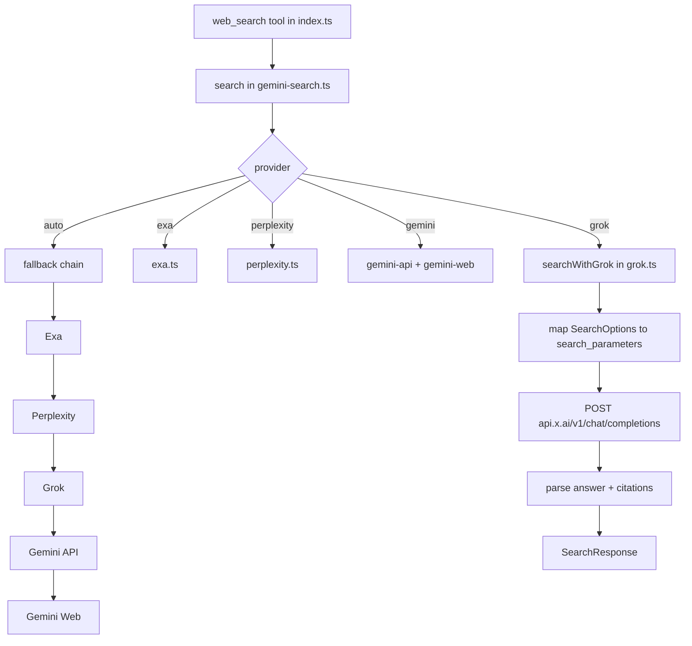

# Grok Search Provider Design

## Summary

为 `pi-web-access` 扩展的 `web_search` 工具新增 `grok` 作为第四个搜索 provider。Grok 走 xAI 的 `/chat/completions` 接口 **+ `search_parameters` 原生 Live Search 能力**：支持 `mode`（on/auto/off）、`sources`（web/news/x）、日期区间（`from_date`/`to_date`）、域名白/黑名单、`max_search_results`，并从响应的原生 `citations` 数组直接拿引用。以最小实现成本补齐 xAI 生态覆盖，质量档次与 Exa/Perplexity 等原生搜索 provider 对齐，并保持与现有通道一致的接口契约、回退语义与配置风格。

## Goals

- 用户可通过 `web_search({ provider: "grok", query })` 显式选用 Grok。
- `auto` 模式下在 Perplexity 之后、Gemini 之前自动回退到 Grok（仅当 `grokApiKey` / `XAI_API_KEY` / `GROK_API_KEY` 可用时）。
- 新增 `grok.ts` 模块隔离 xAI 接入细节，API Surface 与现有 provider 对齐（`isGrokAvailable` / `searchWithGrok`）。
- `SearchOptions` 上的 `numResults` / `recencyFilter` / `domainFilter` 被映射为 `search_parameters` 的**硬参数**，非软提示。
- `~/.pi/web-search.json` 新增 `grokApiKey` / `grokApiModel` / `grokApiBaseUrl` 三个字段；默认模型 `grok-3-mini`，默认 Base URL `https://api.x.ai/v1`。
- README 增补 provider 列表、fallback 顺序说明、Live Search 能力声明、配置示例。
- 不破坏现有 Exa / Perplexity / Gemini 任一路径的行为。

## Primary Users / Roles

- **Pi Agent 终端用户**：希望使用 xAI Key 直接在 web_search 中调用 Grok Live Search，不必再借助第三方代理或 OpenRouter。
- **扩展维护者**：希望新 provider 与现有模块边界清晰一致，便于后续扩展 X/news source 专属功能。

## Non-Goals

- ❌ **不**暴露 Grok 的 X（Twitter）专属 source 为独立 `web_search` 参数（仅保留 `sources = ["web", "news"]` 默认值，后续按需再开）。
- ❌ **不**支持 Grok Vision / 图片输入 / 视频输入。
- ❌ **不**将 Grok 接入 `code_search`（仍专属 Exa MCP）。
- ❌ **不**将 Grok 接入 `fetch_content` 的 URL / YouTube / 视频提取链路（仍走 Gemini）。
- ❌ **不**做 MCP fallback / 免 Key 零配置模式（xAI 无等价能力）。
- ❌ **不**复用 `gemini-api.ts` 的 `geminiApiProtocol: "openai"` 分支（见 Scope Decisions）。

## Context

- 搜索路由层在 [gemini-search.ts](file:///home/venom/workspace/ai/pi-web-access/gemini-search.ts)：维护 `SearchProvider` 联合类型、`search()` 主入口、auto 回退链与配置缓存。
- 现有三个独立 provider 模块：[exa.ts](file:///home/venom/workspace/ai/pi-web-access/exa.ts)、[perplexity.ts](file:///home/venom/workspace/ai/pi-web-access/perplexity.ts)、[gemini-api.ts](file:///home/venom/workspace/ai/pi-web-access/gemini-api.ts) + [gemini-web.ts](file:///home/venom/workspace/ai/pi-web-access/gemini-web.ts)，各自负责 Key 探测、请求、错误处理。
- Tool 注册与 provider 参数校验在 [index.ts](file:///home/venom/workspace/ai/pi-web-access/index.ts)：`normalizeProviderInput` 白名单、`ProviderAvailability` 结构、`defaultProvider` 派发。
- 配置读取统一走 `~/.pi/web-search.json`（`CONFIG_PATH = join(homedir(), ".pi", "web-search.json")`），每个 provider 模块各自解析自己关心的字段 + 缓存（`cachedConfig` 模式）。
- 活动观测使用 [activity.ts](file:///home/venom/workspace/ai/pi-web-access/activity.ts) 的 `activityMonitor.logStart/logComplete/logError`，所有 provider 需统一接入。
- xAI API 约束：
  - 端点 `https://api.x.ai/v1/chat/completions`，请求/响应 schema 在 `messages` 层与 OpenAI 一致。
  - 认证 `Authorization: Bearer <key>`。
  - **原生 Live Search**：顶层 `search_parameters` 字段启用，响应含 `citations: string[]`（URL 列表）；启用时结果由 xAI 后端联网检索。
  - `search_parameters` 关键字段：
    - `mode`: `"on"` 强制搜索 / `"auto"` 模型决定 / `"off"` 关闭。默认 `"off"`；本扩展统一设为 `"on"`。
    - `sources`: 数组，元素形如 `{ type: "web" | "news" | "x", allowed_websites?: string[], excluded_websites?: string[], country?: string }`。
    - `from_date` / `to_date`: `YYYY-MM-DD`。
    - `max_search_results`: 整数，默认 15。
    - `return_citations`: 布尔，默认 true，保持为 true。
  - 官方环境变量惯例为 `XAI_API_KEY`；`GROK_API_KEY` 为社区常见别名。

## Discovery

### Key Discoveries

- **Live Search 可用**：xAI `/chat/completions` 支持顶层 `search_parameters` 字段，功能对齐 Perplexity/Exa 级别（recency、domain 白/黑名单、citations 原生字段）。这使 Grok provider 的质量档次从"prompt-only 幻觉风险"上升为"原生搜索 provider"，不再需要 compatibility note 与 markdown 链接反解。
- **`recencyFilter` → 日期区间映射**：现有 `SearchOptions.recencyFilter = "day" | "week" | "month" | "year"` 需在 `grok.ts` 内部转成 `from_date`（以今日为基准向后回溯），`to_date` 省略（xAI 默认到"今日"）。映射逻辑本地化，不污染 `gemini-search.ts`。
- **`domainFilter` → `sources.allowed_websites` / `excluded_websites`**：现有约定以 `-` 前缀表示排除，需拆分为 `allowed_websites`（不含 `-` 前缀的条目）与 `excluded_websites`（去掉 `-` 前缀后的条目），注入到 `sources[0]`（`type: "web"`）；同时保留一个 `{ type: "news" }` source，除非用户后续显式关闭新闻来源。
- **Citations 原生解析**：响应中的 `citations` 是 URL 字符串数组，需组装为 `SearchResult[]`——`title` 默认 `"Source N"`（xAI 目前只给 URL），`snippet` 为空串；后续若 xAI 补齐富字段可无感升级。
- **保留 System Prompt 作为补充约束**：虽然有 Live Search 原生字段，仍注入固定 system prompt 让模型"以实时 web 研究助手身份、简洁、循证"输出；但**不再强求 JSON 格式**（有原生 citations，不需要反解），system prompt 只负责语气/简洁度，响应文本即 `answer`。
- **协议复用 vs 模块隔离的权衡**：`gemini-api.ts` 已有 `"openai"` 协议分支可以理论复用，但它既不懂 `search_parameters` 也不懂 `citations`，强接只会污染 Gemini 模块；更重要的是会让 `provider="grok"` 语义穿透，混淆 availability 探测。选独立模块更一致。
- **Key 优先级**：需与现有 provider 对齐——`process.env.XAI_API_KEY || process.env.GROK_API_KEY || config.grokApiKey`（环境变量优先于配置文件，两个环境变量任一命中即可）。

### Scope Decisions

- ✅ **启用 Live Search**：`search_parameters.mode = "on"`、`return_citations = true`，将 `recencyFilter` / `domainFilter` / `numResults` 映射为原生参数；**不再**走 prompt-only。
- ✅ **默认 sources = `[{ type: "web" }, { type: "news" }]`**：覆盖绝大多数 web_search 场景；X 源默认不启用（质量差异大，按需再开）。
- ✅ **独立 `grok.ts` 模块**，不复用 `gemini-api.ts` 的 openai 协议分支。
- ✅ **回退顺序 `Exa → Perplexity → Grok → Gemini API → Gemini Web`**：Grok 现在已是原生搜索档次，与 Exa/Perplexity 同级；插在 Perplexity 之后 Gemini 之前，避免改动现有优先链过大。
- ✅ **默认模型 `grok-3-mini`** → 成本 / 延迟 / 通用性平衡。
- ✅ **配置字段 `grokApiKey` / `grokApiModel` / `grokApiBaseUrl`**。
- ✅ **保留固定 system prompt**（简化版）：约束"以实时 web 研究助手身份、简洁、循证"，不强制 JSON 输出。
- ❌ **不**新增 `grokApiProtocol` / `grokApiPath` 字段。
- ❌ **不**在 `web_search` 上暴露 `sources` 入参；如需 X source，后续独立 spec。

## Proposed Solution

新增 `grok.ts`，在模块内完成 `SearchOptions` 到 `search_parameters` 的映射与 `citations` 到 `SearchResult[]` 的反解；在 `gemini-search.ts` 的 `SearchProvider` 联合类型中追加 `"grok"`，在 `search()` 中插入显式分支与 auto 回退；在 `index.ts` 中同步扩展 provider 白名单与可用性结构；README 增补。

### Architecture



### Components

**`grok.ts`（新增）**

- 常量声明：
  - `DEFAULT_GROK_MODEL = "grok-3-mini"`
  - `DEFAULT_GROK_BASE_URL = "https://api.x.ai/v1"`
  - `DEFAULT_MAX_SEARCH_RESULTS = 15`
  - `GROK_SYSTEM_PROMPT`（固定值，不对外暴露）：
    ```
    You are a real-time web research assistant. Use live web search/browsing when answering. Return ONLY a single JSON object with keys: content (string), sources (array of objects with url/title/snippet when possible). Keep content concise and evidence-backed.
    ```
    > 说明：即便走 Live Search，保留该 prompt 作为语气/简洁度/循证约束的兜底；Live Search 已经通过 `citations` 独立返回引用，content 不强依赖其中的 `sources` 字段，解析层遵循"优先 JSON.content、回退整段文本"逻辑。
- `loadConfig()` / `getApiKey()` / `hasGrokApiKey()` / `isGrokAvailable()`：沿用 `perplexity.ts` 的配置缓存与 Key 探测模式。
- 辅助函数：
  - `mapRecencyToDateRange(recency)`：`"day"`→今日回溯 1 日；`"week"`→7 日；`"month"`→30 日；`"year"`→365 日。输出 `{ from_date: "YYYY-MM-DD" }`。
  - `splitDomainFilter(domains)`：按 `-` 前缀拆成 `{ allowed: string[], excluded: string[] }`，去掉前缀。
  - `buildSearchParameters(options)`：组装完整 `search_parameters` 对象（`mode: "on"`、`return_citations: true`、`max_search_results`、`from_date`、`sources = [web(+allowed/excluded), news]`）。
- `searchWithGrok(query, options): Promise<SearchResponse>`：
  - 入参 `SearchOptions`（`numResults` / `recencyFilter` / `domainFilter` / `signal`）。
  - 请求体：
    ```ts
    {
      model,
      messages: [
        { role: "system", content: GROK_SYSTEM_PROMPT },
        { role: "user",   content: query },
      ],
      search_parameters: buildSearchParameters(options),
      max_tokens: 1024,
    }
    ```
    > 注意：`user` 消息**直接传 query**，不再用 `buildSearchPrompt` 把 recency/domain 嵌进 prompt（已由 `search_parameters` 硬过滤）。
  - `activityMonitor.logStart({ type: "api", query })`；`logComplete(activityId, status)` / `logError` / abort 时 status=0。
  - **响应解析**：
    1. `raw = choices[0].message.content`；尝试 `JSON.parse(raw)`，成功且结构匹配 → `answer = parsed.content`。
    2. 否则 `answer = raw`（整段文本）。
    3. `results`：**优先**从响应 `citations` 数组（URL 列表）构建 `{ title: "Source N", url, snippet: "" }`；若 `citations` 缺失（旧模型或 mode=off fallback），再从 `parsed.sources`（若有）或 `extractSourceUrls(answer)` 反解作为兜底。
    4. `results` 长度裁剪至 `Math.min(len, options.numResults ?? 5)`。
  - **不再**追加 prompt-only compatibility note（Live Search 已激活）。

**`gemini-search.ts`（改动）**

- `SearchProvider` 增加 `"grok"`。
- `normalizeSearchProvider` 白名单增加 `"grok"`。
- `search()`：
  - 新增 `if (provider === "grok")` 分支：调 `searchWithGrok`，返回 `{ ...result, provider: "grok" }`；Key 缺失时抛清晰错误（提示 `grokApiKey` / `XAI_API_KEY` / `GROK_API_KEY`）。
  - auto 回退链在 Perplexity 之后、Gemini 之前插入：`if (provider !== "grok" && isGrokAvailable()) { try searchWithGrok ... }`。
- 将 `extractSourceUrls` 由 module-private 改为 `export`（`grok.ts` 兜底时复用）。
- 无需 export `buildSearchPrompt`（Grok 走原生 `search_parameters`，user message 直接用 query）。

**`index.ts`（改动）**

- `normalizeProviderInput` 白名单追加 `"grok"`。
- `ProviderAvailability` 接口增加 `grok: boolean`。
- 组装 `availableProviders` 时调用 `isGrokAvailable()`。
- `defaultProvider` 计算逻辑如依赖顺序表，加入 Grok 到 auto 回退顺序位置（Perplexity 后）。
- `web_search` 工具的 `provider` 入参描述更新为 `auto / exa / perplexity / grok / gemini`。
- 错误消息中 "No search provider available" 补充 Grok 配置提示。

**`README.md`（改动）**

- `## Install` 示例配置 JSON 追加 `"grokApiKey": "xai-..."`。
- `## Tools > web_search > provider` 列表追加 `grok`。
- `## How It Works` 的回退链改为 `Exa → Perplexity → Grok → Gemini API → Gemini Web`。
- 新增小节说明 Grok 走 xAI Live Search（recency/domain 为原生硬参数、citations 原生返回、sources 默认 web+news）。
- `## Configuration` 示例追加 `grokApiKey / grokApiModel / grokApiBaseUrl` 字段。
- 环境变量说明追加 `XAI_API_KEY` / `GROK_API_KEY`。

### Data Flow

主路径（显式 `provider: "grok"`）：

1. Pi Agent 调用 `web_search({ query, provider: "grok", recencyFilter: "week", domainFilter: ["github.com", "-reddit.com"], numResults: 8 })` → `index.ts` 校验 provider 并透传。
2. `gemini-search.ts#search` 命中 `provider === "grok"` 分支 → 调 `searchWithGrok(query, options)`。
3. `grok.ts`：
   a. `loadConfig()` → `getApiKey()` 按 `XAI_API_KEY > GROK_API_KEY > config.grokApiKey` 取 Key。
   b. `activityMonitor.logStart`。
   c. `buildSearchParameters(options)`：
      - `mode: "on"`, `return_citations: true`
      - `max_search_results: 8`
      - `from_date: <今日-7 日 YYYY-MM-DD>`
      - `sources: [{ type: "web", allowed_websites: ["github.com"], excluded_websites: ["reddit.com"] }, { type: "news" }]`
   d. 组装 `messages = [{role:"system", content: GROK_SYSTEM_PROMPT}, {role:"user", content: query}]`。
   e. `fetch(${baseUrl}/chat/completions, { headers: Bearer, body, signal })`。
   f. 解析响应：
      - `raw = choices[0].message.content`；`JSON.parse` 成功取 `content`，否则用 raw。
      - `citations = data.citations` → `SearchResult[]`（title 回填 "Source N"、snippet 空）。
      - `citations` 为空时才走 `extractSourceUrls(raw)` 兜底。
      - 裁剪至 `numResults`。
   g. `activityMonitor.logComplete(activityId, status)`。
4. 返回 `{ answer, results, provider: "grok" }` 给 tool caller；若 `includeContent` 为真，上层按现有逻辑拉取 inlineContent。

auto 回退路径：

1. `search()` 先后尝试 Exa → Perplexity，均失败或不可用。
2. `isGrokAvailable()` 为真 → 进入 `searchWithGrok`；异常时 push 到 `fallbackErrors` 继续往下尝试 Gemini。
3. 全部失败抛合并错误。

## Error Handling

| 场景 | 处理 |
|---|---|
| Key 未配置 | `isGrokAvailable` 返回 false；显式 `provider: "grok"` 时抛清晰错误，列出三种 Key 配置途径 |
| `fetch` 网络异常 | 捕获 → `activityMonitor.logError` → 抛出，auto 模式下记入 `fallbackErrors` 继续 |
| HTTP 非 2xx | 读 `response.text()`，抛 `Grok API error <status>: <body>`；`activityMonitor.logComplete(activityId, status)` |
| `search_parameters` 被模型拒识 / 400 | 上层视同常规 4xx，抛错并记入 `fallbackErrors`；**不做**自动降级到无 search 的再请求（避免掩盖配置错误） |
| `citations` 字段缺失 | 不抛错；从 `JSON.parse(content).sources` 或 `extractSourceUrls(raw)` 兜底 |
| JSON 解析失败 | **不抛错**——`answer = raw`，`results` 走 citations 或兜底解析 |
| `choices[0].message.content` 为空 | 若 `citations` 也为空，返回 `{ answer: "", results: [] }` 让 auto 链回退 |
| Abort（signal 取消） | message 含 "abort" → `logComplete(activityId, 0)` 并重新抛出；`search()` 层保留并上抛 |
| `recencyFilter` / `domainFilter` 格式非法 | `domainFilter` 沿用现有项目风格静默过滤（不抛）；`recencyFilter` 落在白名单外时不注入 `from_date`（等同不过滤） |

## Testing

无自动化测试框架；按 AGENTS.md 要求做手动冒烟。每条在 PR 描述里列出实际命令与输出摘要：

1. **显式 Grok Key 路径 + Live Search**：配置 `grokApiKey`，`web_search({ query: "TypeScript 5.6 release notes", provider: "grok" })` → 返回 answer 简洁循证、results 从 `citations` 填充至少 1 条、activity 面板显示 api 调用 200 成功。
2. **显式 Grok 但 Key 缺失**：移除 Key，`provider: "grok"` → 抛包含 `grokApiKey / XAI_API_KEY / GROK_API_KEY` 的清晰错误。
3. **auto 回退到 Grok**：移除 Exa 和 Perplexity Key，保留 Grok Key 与 Gemini Key，`web_search({ query })`（auto） → 实际选用 Grok（通过 activity 或返回 `provider` 字段验证）。
4. **auto 跳过 Grok**：移除 Grok Key，保留其他 → 回退链跳过 Grok 进入 Gemini，行为不变。
5. **Abort 取消**：触发 abort → 活动状态码 0、无残留 pending 请求。
6. **`recencyFilter` 硬过滤**：`recencyFilter: "week"` → 人工抽查 `citations` URL 指向的页面发布时间均在近 7 日内（或最接近）。
7. **`domainFilter` 硬过滤**：`domainFilter: ["github.com"]` → 所有 `citations` 都来自 github.com；`["-reddit.com"]` → 无 reddit.com；混用 `["github.com", "-reddit.com"]` → 仅 github.com 且无 reddit.com。
8. **`numResults` 硬截断**：`numResults: 3` → `results` 最多 3 条（与 xAI `max_search_results` 一致）。
9. **Citations 字段缺失兜底**：构造一次 xAI 返回无 `citations` 的响应（如 mode=off 或特殊模型），验证降级为 `extractSourceUrls(raw)` 仍能拿到 ≥0 条。
10. **配置 `grokApiBaseUrl` 覆盖**：指向自建 OpenAI 兼容代理（如有）或打印请求 URL 日志，验证请求走覆盖后的地址。
11. **`npm pack` 能正常打包**，产物包含新文件 `grok.ts`。

## Open Questions

1. `DEFAULT_GROK_MODEL`（`grok-3-mini`）是否随 xAI 后续模型迭代频繁过期？→ 采用**默认常量 + 配置覆盖**，由用户/README 维护；后续如有稳定 alias 再替换。
2. 是否需要在 curator UI 的 provider 切换下拉中显式加入 Grok 选项？→ 默认包含（与其他 provider 对齐），若 UI 需要额外适配放到本 spec 的 tasks 中处理。
3. Rate limit：xAI 未公布硬性 RPM；是否需要像 Perplexity 一样加客户端限流？→ **暂不加**，观察线上反馈后再增加。
4. 是否需要在 `web_search` 上暴露 `sources` 选项（如启用 X 源）？→ **本 spec 不做**，默认 `web + news`；后续按需独立 spec。
